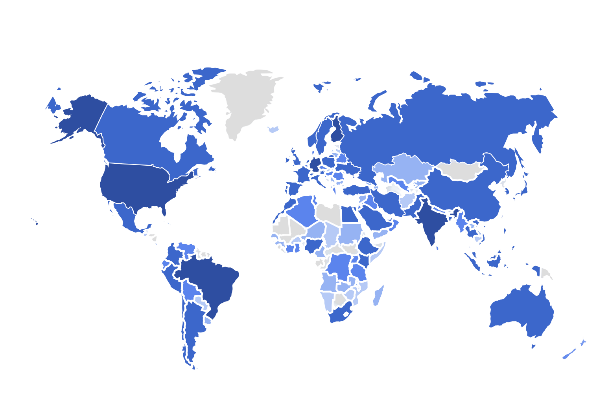

**Our current partners:**

import PartnerGrid from '../../../components/PartnerGrid.astro';
import partners from '../../../data/partners.json';

<PartnerGrid partners={partners} />

### Partner with Us to Evolve the APIOps Cycles Method

APIOps Cycles continues to grow as a practical, open method for API strategy and development—used by hundreds of organizations globally. Our continuous evolution relies on active partnerships that contribute tools, training, content, and community support.

We're seeking partners who can help us:

* Deliver workshops, training, and consulting using the APIOps Cycles method
* Build and share tools (canvases, diagnostics, templates)
* Write case studies, publish content, and share real-world use cases
* Translate and localize materials for global reach
* Support community events, research, and method improvements

:::tip[Interested?]{icon="star"}

[Get in touch](https://www.osaango.com/contact-us) to explore how we can work together.

:::

---

### Join the Community & Find Support

The APIOps Cycles community is open to everyone — whether you're an API newcomer or managing enterprise-scale platforms. We welcome API producers, consumers, architects, educators, and consultants alike.

import { LinkButton } from '@astrojs/starlight/components';

<LinkButton data-formkit-toggle="dfc21aabae" href="https://osaango.kit.com/dfc21aabae">Join the community mailing list</LinkButton>

As a community member, you can:

* Attend meetups and public webinars
* Provide feedback and suggest improvements to canvases and the method
* Participate in open-source development of the APIOps Cycles method and tools like Canvas Creator to fit your needs better, and to bring about your skills and experience.
* Share your experiences, tooling insights, and lessons learned
* Stay informed about updates, events, and new releases
