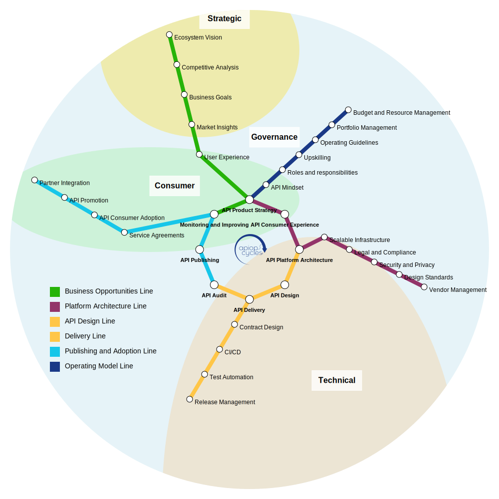

APIOps Cycles é um método Lean e inspirado no design de serviços para projetar, melhorar e dimensionar APIs.
O APIOps Cycles é gratuito para uso, adaptação e compartilhamento sob a licença [Creative Commons Attribution–ShareAlike 4.0](https://creativecommons.org/licenses/by-sa/4.0/). Desenvolvido [desde 2017](../changelog/), o APIOps Cycles cresceu por meio de contribuições da comunidade e projetos reais em diversos setores.

Para desenvolvedores ou qualquer pessoa que queira contribuir com o método, usá-lo localmente ou como parte de seus produtos e serviços, [todo o método consiste em alguns arquivos JSON e markdown localizados](https://github.com/APIOpsCycles/apiops-cycles-method-data.git) usados por este site e pela ferramenta aberta APIOps Cycles, também disponível como pacote npm. Não deixe de conferir a página de parceiros e comunidade, que pode ajudá-lo a usar o método e com outras necessidades de estratégia de produtos API e melhores práticas. 

O método APIOps Cycles é construído em torno de um **mapa de metrô** com estações e linhas — cada uma representando um aspecto crítico do ciclo de vida da API.

## Como funciona (em resumo)

Pense no APIOps Cycles como um **sistema de metrô**:
- [**Estações centrais**](../core-stations/) = Atividades com foco em uma capacidade específica da API (por exemplo, estratégia, design, auditoria, entrega).
- [**Estações suburbanas**](../suburb-stations/) = Domínios de suporte (por exemplo, segurança, conformidade, localização).
- [**Linhas de metrô**](../lines/) = Fluxos de trabalho temáticos que orientam sua equipe desde o ponto de partida até uma capacidade alvo (por exemplo, oportunidades de negócios, modelo operacional, arquitetura da plataforma).
- **Subúrbios** = Perspectivas onde várias estações centrais, estações suburbanas e linhas de metrô convergem (por exemplo, perspectivas estratégicas, de governança, técnicas e do consumidor).
- [**Recursos**](../recursos/) = Telas, diretrizes e listas de verificação vinculadas às estações centrais e suburbanas para ajudar sua equipe a colaborar e atender aos critérios de entrada e saída de cada estação central enquanto você avança ao longo das linhas.
Você pode entrar no sistema em qualquer lugar — dependendo do seu objetivo — e voltar, validar ou iterar.

## Começando em 3 etapas

**1. Identifique seu desafio atual com API**
    
- Você **não precisa visitar todas as estações em ordem**. Em vez disso, comece onde estão as necessidades ou pontos fracos atuais da sua equipe ou organização, navegando pelas [linhas do metrô](), e marcando os critérios de entrada para cada estação.

**2. Escolha o seu caminho de início rápido**
- Nova construção? Redesenho importante? Governança e dimensionamento?

**3. Precisa colaborar com a sua equipe?**
- Verifique as instruções e os links para telas e outros recursos na página de cada estação. Baixe nas páginas de recursos ou abra o [CanvasCreator](http://canvascreator.apiopscycles.com), a ferramenta de demonstração de código aberto que ajuda você a preencher ou exportar qualquer uma das telas localizadas como JSON, SVG ou PNG e compartilhar com sua equipe. Também disponível como pacote npm.