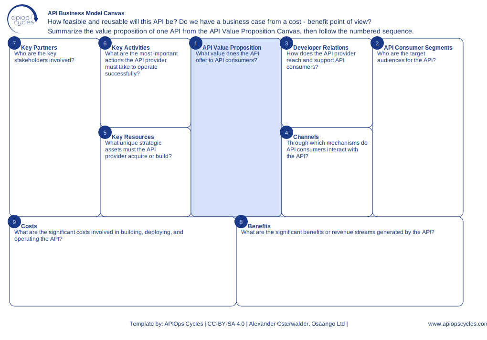

import { Aside } from '@astrojs/starlight/components';
import CanvasCreator from '../../../components/CanvasCreator.astro';

Strategically assess API business viability by mapping value propositions, consumer segments, and key resources.

## Outcomes

- Clear business strategy for APIs

## How it works

[SVG](../../../assets/resource/Canvas_apiBusinessModelCanvas.svg) | [PNG](../../../assets/resource/Canvas_apiBusinessModelCanvas.png) | [JSON](../../../assets/resource/Canvas_apiBusinessModelCanvas.json)

### Steps

1. Summarize the API's value proposition
2. Define consumer segments
3. Identify developer relations strategies
4. Map distribution channels
5. document key resources and activities
6. Identify key partners and stakeholders
7. Highlight benefits and costs

<Aside type="tip">

- Start with a single API to ensure clarity
- Use metrics like cost vs. benefit to prioritize opportunities
- Validate outputs with key stakeholders
</Aside>

<CanvasCreator canvasId="apiBusinessModelCanvas" />
