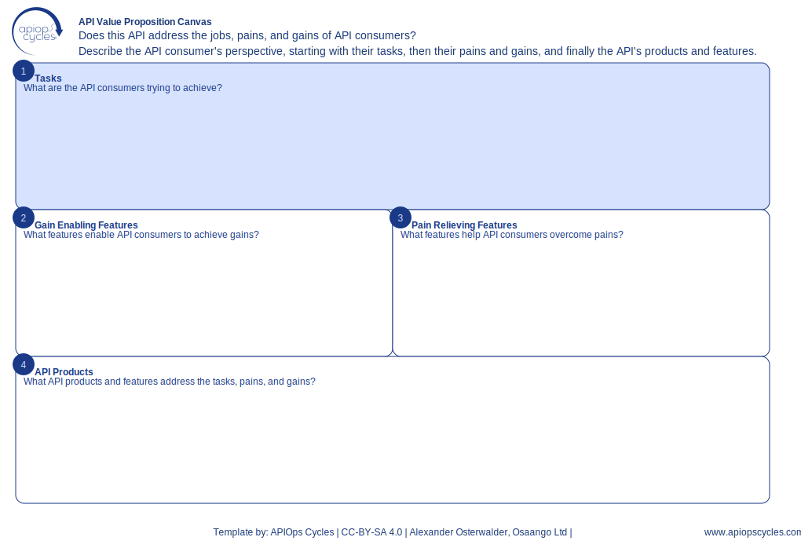

import { Aside } from '@astrojs/starlight/components';
import CanvasCreator from '../../../components/CanvasCreator.astro';

Align API features with user needs by mapping tasks, pains, and gains to API products.

## Outcomes

- Focused feature development

## How it works

[SVG](../../../assets/resource/Canvas_apiValuePropositionCanvas.svg) | [PNG](../../../assets/resource/Canvas_apiValuePropositionCanvas.png) | [JSON](../../../assets/resource/Canvas_apiValuePropositionCanvas.json)

### Steps

1. List user journey tasks
2. Identify features delivering expected gains
3. Define features addressing challenges
4. Map features to API products

<Aside type="tip">

- Use input from the Customer Journey Canvas
- Highlight features that relieve pains or enhance gains
- Validate features with API consumers to ensure alignment
</Aside>

<CanvasCreator canvasId="apiValuePropositionCanvas" />
