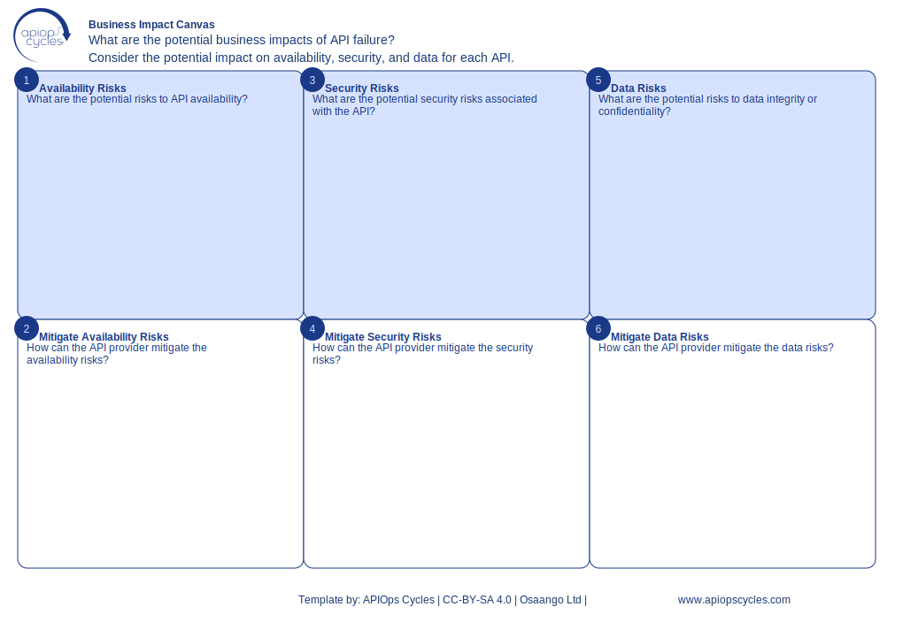

import { Aside } from '@astrojs/starlight/components';
import CanvasCreator from '../../../components/CanvasCreator.astro';

Design a scalable and secure API platform architecture that meets business and technical requirements.

## Outcomes

- Scalable API infrastructure

## How it works

[SVG](../../../assets/resource/Canvas_businessImpactCanvas.svg) | [PNG](../../../assets/resource/Canvas_businessImpactCanvas.png) | [JSON](../../../assets/resource/Canvas_businessImpactCanvas.json)

### Steps

1. Availability Risks: Identify risks and impacts.
2. Ways to Mitigate Availability Risks: Define mitigation measures.
3. Security Risks: Document security-related risks.
4. Ways to Mitigate Security Risks: Propose strategies to mitigate security risks.
5. Data Risks: Identify risks to data accuracy or availability.
6. Ways to Mitigate Data Risks: Plan strategies to address data risks.

<Aside type="tip">

- Involve architects and developers in the design process
- Use past incidents to identify potential risks
- Prioritize critical APIs with the highest business impact
</Aside>

<CanvasCreator canvasId="businessImpactCanvas" />
