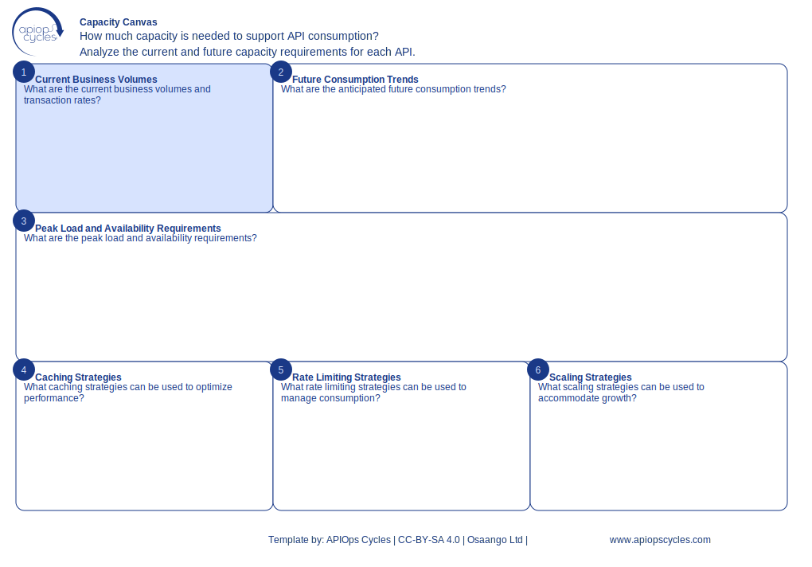

import { Aside } from '@astrojs/starlight/components';
import CanvasCreator from '../../../components/CanvasCreator.astro';

Plan API capacity to meet current and future business demands, ensuring scalability and performance.

## Outcomes

- Aligned API capacity with business volumes

## How it works

[SVG](../../../assets/resource/Canvas_capacityCanvas.svg) | [PNG](../../../assets/resource/Canvas_capacityCanvas.png) | [JSON](../../../assets/resource/Canvas_capacityCanvas.json)

### Steps

1. Document current business volumes
2. Forecast future consumption trends
3. Plan for peak load and availability requirements
4. Define caching and rate-limiting strategies
5. Propose scaling strategies

<Aside type="tip">

- Use analytics to forecast growth trends
- Define peak usage scenarios
- Include scalability testing in the planning phase
</Aside>

<CanvasCreator canvasId="capacityCanvas" />
