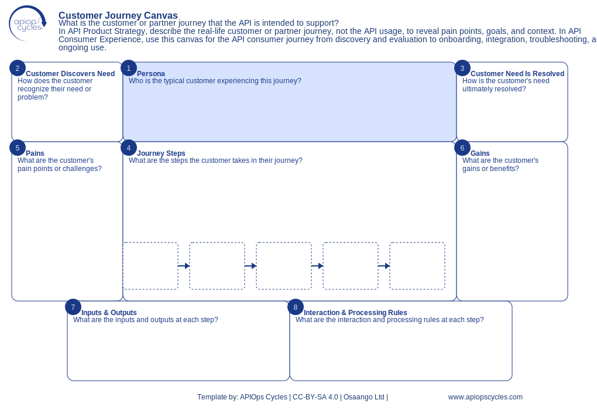

import { Aside } from '@astrojs/starlight/components';
import CanvasCreator from '../../../components/CanvasCreator.astro';

Map customer journeys to identify needs and pain points, enhancing API design and user experience.

## Outcomes

- Improved customer understanding

## How it works

[SVG](../../../assets/resource/Canvas_customerJourneyCanvas.svg) | [PNG](../../../assets/resource/Canvas_customerJourneyCanvas.png) | [JSON](../../../assets/resource/Canvas_customerJourneyCanvas.json)

### Steps

1. Define customer persona
2. Identify triggers for the journey
3. Describe the journey's end
4. Map journey steps with inputs/outputs
5. Identify customer pains
6. Summarize customer gains
7. Define necessary inputs and resulting outputs
8. Define API interactions for each step

<Aside type="tip">

- Iterate with team input to refine steps
- Use outputs from this canvas to inform other canvases like the API Value Proposition Canvas
</Aside>

<CanvasCreator canvasId="customerJourneyCanvas" />
