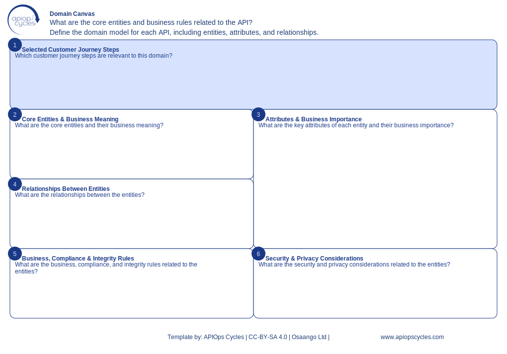

import { Aside } from '@astrojs/starlight/components';
import CanvasCreator from '../../../components/CanvasCreator.astro';

A modeling tool to define and communicate the key entities and relationships in your domain, ensuring semantic consistency across APIs.

## Outcomes

- Better understanding of domain canvas principles

## How it works

[SVG](../../../assets/resource/Canvas_domainCanvas.svg) | [PNG](../../../assets/resource/Canvas_domainCanvas.png) | [JSON](../../../assets/resource/Canvas_domainCanvas.json)

### Steps

1. Define core entities, their attributes, and relationships to create a shared conceptual understanding across APIs.

<Aside type="tip">

- Customize the Domain Canvas for your domain
- Use it collaboratively across business and tech roles
</Aside>

<CanvasCreator canvasId="domainCanvas" />
