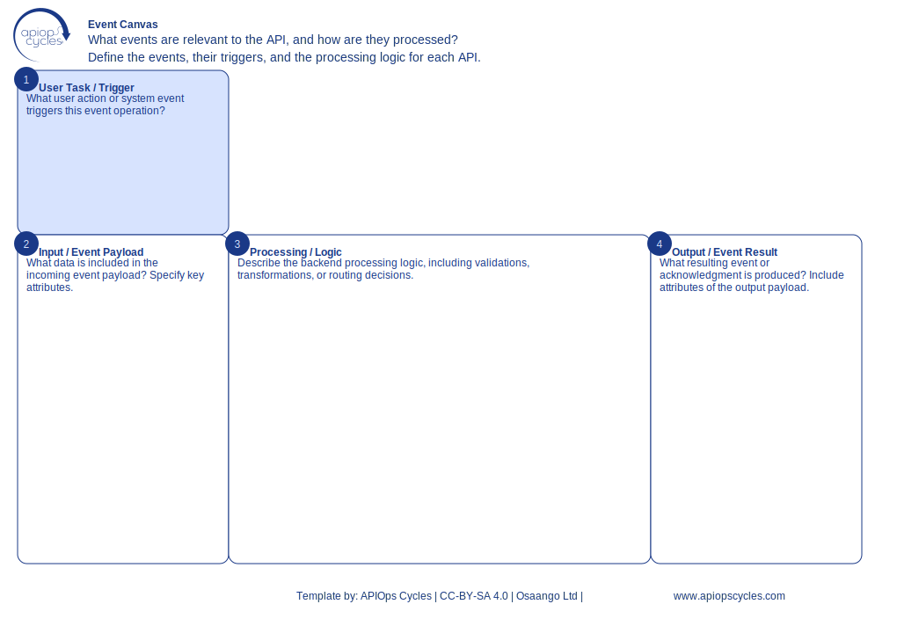

import { Aside } from '@astrojs/starlight/components';
import CanvasCreator from '../../../components/CanvasCreator.astro';

Design event-driven APIs by defining events, triggers, and processing logic.

## Outcomes

- Defined event-driven architecture

## How it works

[SVG](../../../assets/resource/Canvas_eventCanvas.svg) | [PNG](../../../assets/resource/Canvas_eventCanvas.png) | [JSON](../../../assets/resource/Canvas_eventCanvas.json)

### Steps

1. Identify key events in the system
2. Define triggers for each event
3. Describe backend processing logic for events
4. Specify resulting outputs or acknowledgments

<Aside type="tip">

- Use event schemas to standardize event formats
- document event flows and dependencies
- Validate event processing with test cases
</Aside>

<CanvasCreator canvasId="eventCanvas" />
