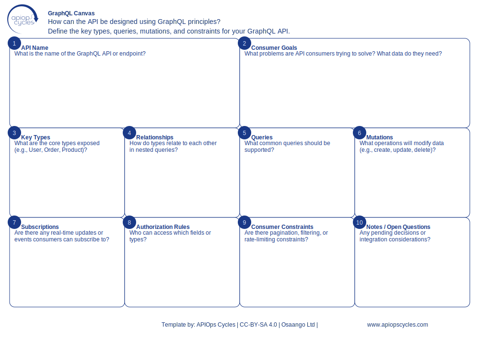

import { Aside } from '@astrojs/starlight/components';
import CanvasCreator from '../../../components/CanvasCreator.astro';

Design GraphQL APIs by defining types, queries, mutations, and subscriptions.

## Outcomes

- Structured GraphQL API design

## How it works

[SVG](../../../assets/resource/Canvas_graphqlCanvas.svg) | [PNG](../../../assets/resource/Canvas_graphqlCanvas.png) | [JSON](../../../assets/resource/Canvas_graphqlCanvas.json)

### Steps

1. What problems are API consumers trying to solve? What data do they need?
2. Define GraphQL types and their attributes: What are the core types exposed (e.g., User, Order, Product)?
3. Map relationships between types: How do types relate to each other in nested queries?
4. Specify queries for data retrieval
5. Define mutations for data modification: What operations will modify data (e.g., create, update, delete)?
6. Outline subscriptions for real-time updates
7. Define authentication and authorization: Who can access which fields or types?
8. Consider if there are any pagination, filtering, or rate-limiting constraints

<Aside type="tip">

- Use introspection to validate type definitions
- document example queries and mutations
- Ensure type names are descriptive and consistent
</Aside>

<CanvasCreator canvasId="graphqlCanvas" />
