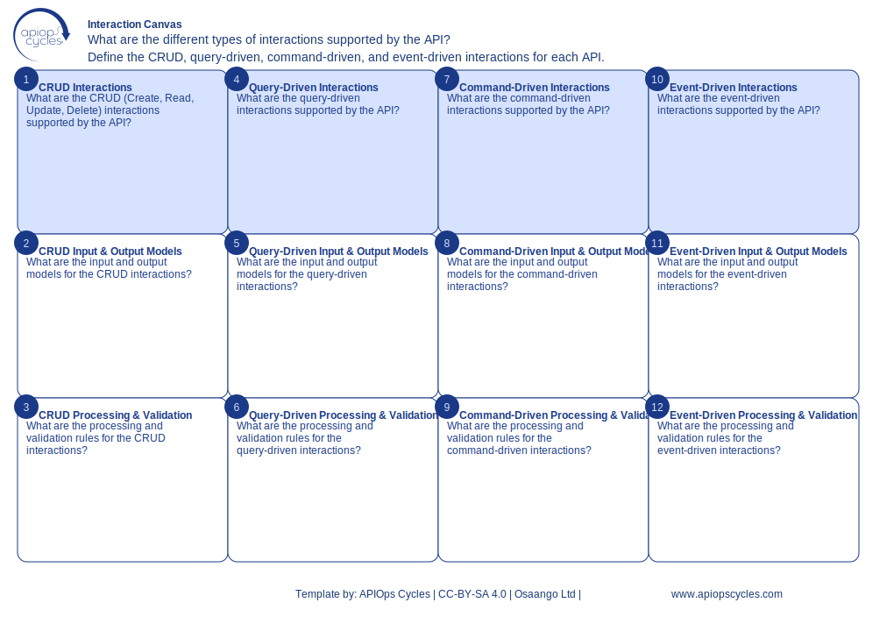

import { Aside } from '@astrojs/starlight/components';
import CanvasCreator from '../../../components/CanvasCreator.astro';

Define API interactions, workflows, and expected responses to ensure a consistent API consumer experience.

## Outcomes

- Clear API interaction workflows

## How it works

[SVG](../../../assets/resource/Canvas_interactionCanvas.svg) | [PNG](../../../assets/resource/Canvas_interactionCanvas.png) | [JSON](../../../assets/resource/Canvas_interactionCanvas.json)

### Steps

1. Map API interactions to user tasks
2. Define endpoints for each interaction
3. document inputs and outputs for each interaction
4. Specify validation rules and constraints
5. Create interaction models for CRUD, query-driven, command-driven, and event-driven interactions

<Aside type="tip">

- Start with common use cases before handling edge cases
- Simulate interactions with mock data to validate workflows
- document expected responses for successful and unsuccessful interactions
</Aside>

<CanvasCreator canvasId="interactionCanvas" />
