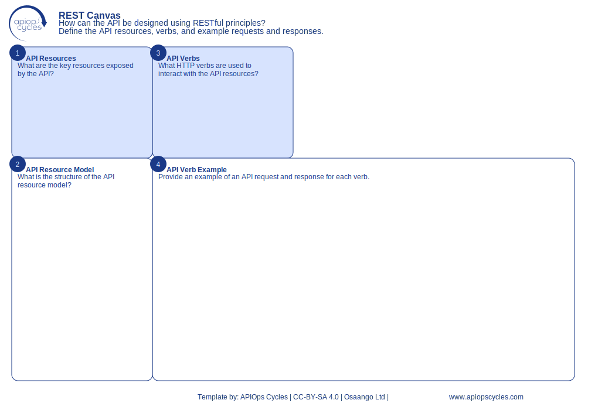

import { Aside } from '@astrojs/starlight/components';
import CanvasCreator from '../../../components/CanvasCreator.astro';

Design APIs using RESTful principles, defining resources, verbs, and example requests and responses.

## Outcomes

- Consistent RESTful API design

## How it works

[SVG](../../../assets/resource/Canvas_restCanvas.svg) | [PNG](../../../assets/resource/Canvas_restCanvas.png) | [JSON](../../../assets/resource/Canvas_restCanvas.json)

### Steps

1. Identify key resources exposed by the API
2. Define the structure of the API resource model
3. Specify HTTP verbs used to interact with resources
4. Provide example requests and responses for each verb

<Aside type="tip">

- Use standard HTTP methods (GET, POST, PUT, DELETE)
- Ensure resource URIs are intuitive and consistent
- document error handling and response codes
</Aside>

<CanvasCreator canvasId="restCanvas" />
